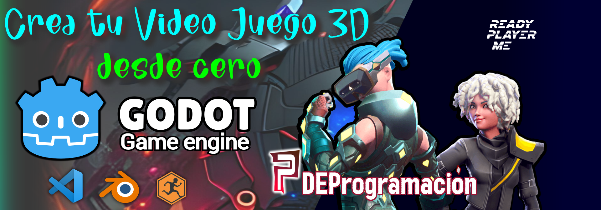

# Prácticas del Curso "Crea tu Videojuego 3D desde Cero" - Godot 4

¡Bienvenido al repositorio de prácticas para el curso "Crea tu Videojuego 3D desde Cero"! En este repositorio encontrarás los archivos y recursos utilizados en las prácticas del curso, específicamente relacionados con el uso de Godot 4, Blender, Mixamo, y ReadyPlayerMe.

## Acerca del Curso

Este curso te guiará a través de la creación de un videojuego en 3D desde cero, utilizando el motor de juego Godot 4. Cada práctica se centra en un aspecto específico del desarrollo de videojuegos, desde la creación de personajes hasta la implementación de mecánicas de juego y mucho más.

## Prácticas Disponibles

Aquí están las prácticas relacionadas con Godot 4 que puedes encontrar en este repositorio:

1. [Práctica: Creación de un Personaje 3D]:
   - Descripción: Creación de un personaje 3D utilizando ReadyPlayerMe.
   - Archivo: [Player.glb](/Curso%20VideoJuego%203D/Player.glb).
     
   - Descripción: Animaciones en Blender y Mixamo para nuestro personaje 3D.
   - Archivo: [Player.blend.zip](/Curso%20VideoJuego%203D/Player.blend.zip).

   - Descripción: Exportar un personaje 3D en formato GLB para godot (Con todas las animaciones utilizadas en el curso).
   - Archivo: [PlayerFinal.glb](/Curso%20VideoJuego%203D/PlayerFinal.glb).
     
2. [Práctica: Creación de una plataforma simple]:
   - Descripción: Creamos una plataforma 3D simple, aqui os dejo las texturas utilizadas.
   - Archivo: [grids.zip](/Curso%20VideoJuego%203D/grids.zip).
     
3. [Práctica: Configuración de Cámara en Tercera Persona]:
   - Descripción: Configuración de una cámara en tercera persona para seguir al personaje Script de la camara.
   - Archivo: [CameraController.cs](/Curso%20VideoJuego%203D/CameraController.cs).
     
4. [Códigos: Player en Tercera Persona, Cámara, Arma, Mira, Balas]:
   - Descripción: Configuración de un Personaje con animaciones y movimiento en tercera persona.
   - Archivo: [Player.cs](/Curso%20VideoJuego%203D/Player.cs).
   - Archivo: [Bullet.cs](/Curso%20VideoJuego%203D/Bullet.cs).
   - Archivo: [Weapon.cs](/Curso%20VideoJuego%203D/Weapon.cs).
   - Archivo: [CameraController.cs](/Curso%20VideoJuego%203D/CameraController.cs).
   - Archivo: [Sight.cs](/Curso%20VideoJuego%203D/Sight.cs).
     
5. [Práctica: Cinemática Inversa]:
   - Descripción: Arma utilizada en la práctica.
   - Archivo: [AK-47.glb](/Curso%20VideoJuego%203D/AK-47.glb).

¡Explora cada práctica para obtener más detalles y acceder a los archivos correspondientes!

## Instrucciones de Uso

1. Clona o descarga este repositorio a tu máquina local.
2. Navega a la práctica específica que deseas explorar.
3. Encuentra los archivos, recursos y scripts relacionados con esa práctica.

¡Disfruta explorando y aprendiendo con las prácticas de Godot 4 en este curso! Si tienes alguna pregunta o inquietud, no dudes en contactarnos.

## Contribuciones

¡Las contribuciones son bienvenidas! Si tienes mejoras, correcciones o nuevas prácticas para agregar, no dudes en abrir una solicitud de pull.

Si deseas contribuir con donaciones, aquí te dejamos los métodos:

Binance: cesarbmath@gmail.com

BTC, USDT, BNB (red BEP20): 0x32d030b187ff0333a69ab1cd648d7fecc18502b8

BTC (red BTC):
16D68khtJdUxbJVYSkpohux9iKKDD2LMWv

## Licencia

Este repositorio está bajo la Licencia GNU GENERAL PUBLIC LICENSE. Consulta el archivo [LICENSE](/LICENSE) para obtener más detalles.

---

**Curso "Crea tu Videojuego 3D desde Cero"**
Sitio web: [https://www.youtube.com/@pdeprogramacion/playlists](https://www.youtube.com/@pdeprogramacion/playlists)

