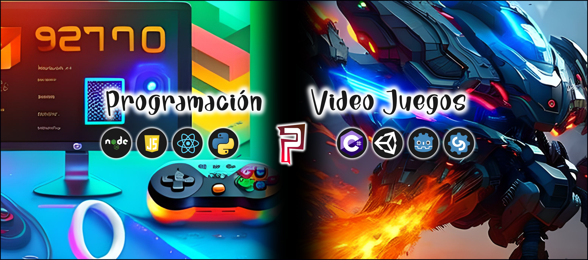

# Proyectos de Programación y Videojuegos - PDEProgramacion

¡Bienvenido al repositorio oficial de **PDEProgramacion**!

## Descripción

Este repositorio acompaña a los contenidos de nuestro canal de YouTube, **PDEProgramacion**, donde exploramos el emocionante mundo de la programación y los videojuegos. Aquí encontrarás los recursos, códigos fuente y proyectos que presentamos en nuestros videos.

## Contenido

## Cómo Empezar

1. Clona este repositorio en tu máquina local.
2. Explora las carpetas de los proyectos para acceder al código fuente y recursos.
3. Sigue las instrucciones en los README de los proyectos para configurar y ejecutar el código.

## Contribuciones

¡Tu contribución es bienvenida! Si deseas reportar problemas, mejoras o proponer nuevas ideas, por favor crea "issues". Si deseas contribuir con código, crea un "pull request" para que podamos revisar tus cambios.

Si deseas contribuir con donaciones, aquí te dejamos los métodos:

-----------------------------------------------------------------------------------------------------------
Para colaborar con el Canal:
Binance: cesarbmath@gmail.com
BTC, USDT, BNB (red BEP20): 0x32d030b187ff0333a69ab1cd648d7fecc18502b8

BTC (red BTC):
16D68khtJdUxbJVYSkpohux9iKKDD2LMWv

## Canal de YouTube

¡No olvides visitar nuestro [Canal de YouTube](https://www.youtube.com/@pdeprogramacion) para ver nuestros videos y aprender más sobre programación y videojuegos!

# Redes Sociales

Síguenos en Twitter: https://twitter.com/PDEProgramacion

## Contacto

Si tienes alguna pregunta o comentario, no dudes en contactarnos en [prodeprogramacion@gmail.com](mailto:prodeprogramacion@gmail.com
) o a través de nuestras redes sociales.

¡Diviértete explorando y aprendiendo a través de este repositorio!

